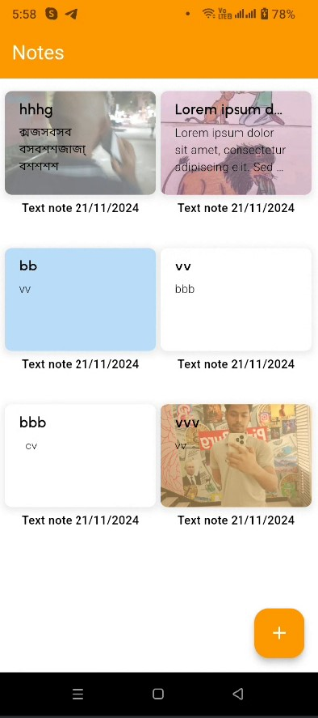

Notes App
A professional Flutter-based application designed for managing notes efficiently.

Getting Started
This project is a starting point for a feature-rich notes application. It allows users to create, manage, and organize notes with a sleek, user-friendly interface.

Features:
Customizable note management
Clean and modern UI design
Resources to help you get started:

For help getting started with Flutter development, view the
[online documentation](https://docs.flutter.dev/), which offers tutorials,
samples, guidance on mobile development, and a full API reference.
# notes_app
